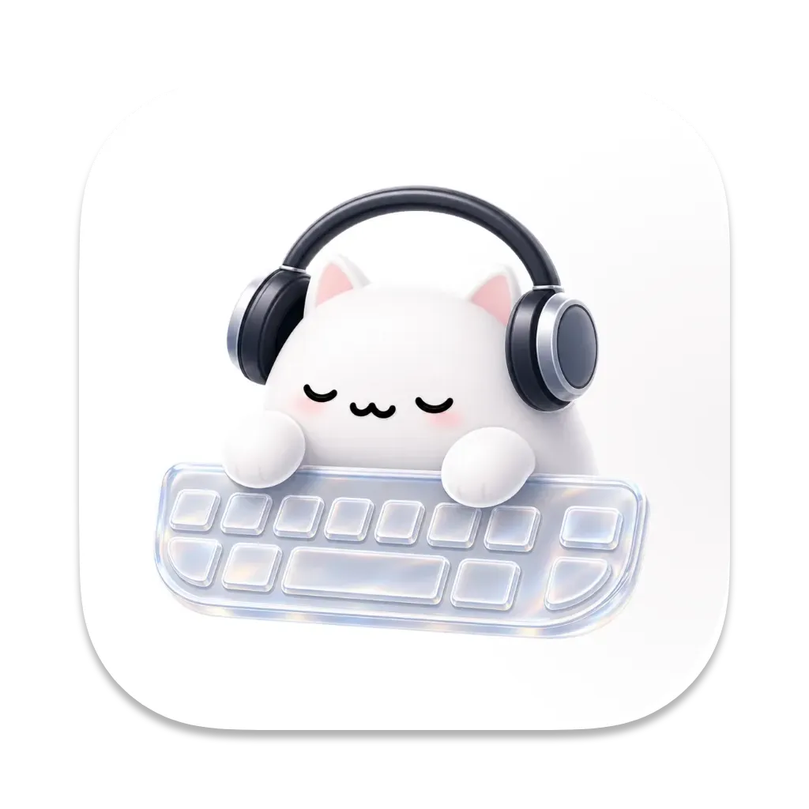
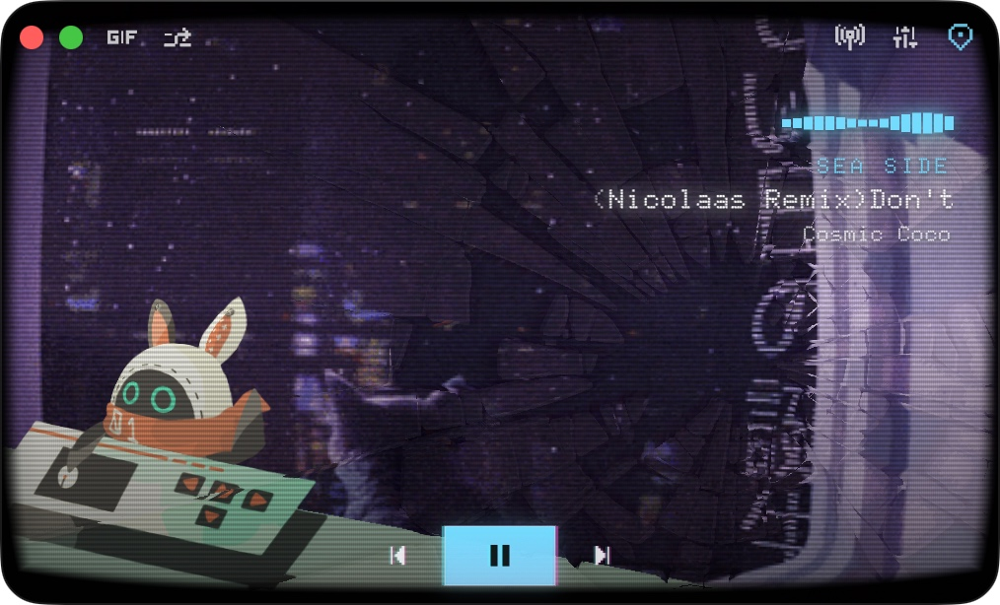
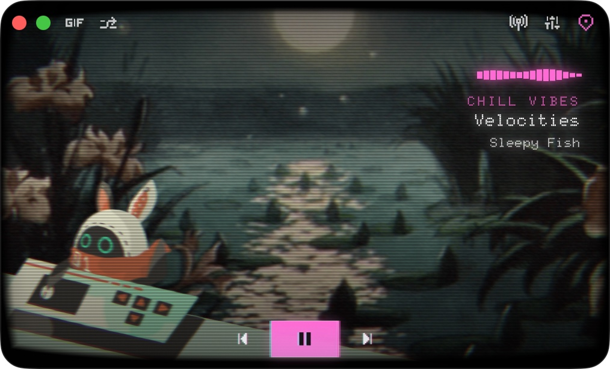
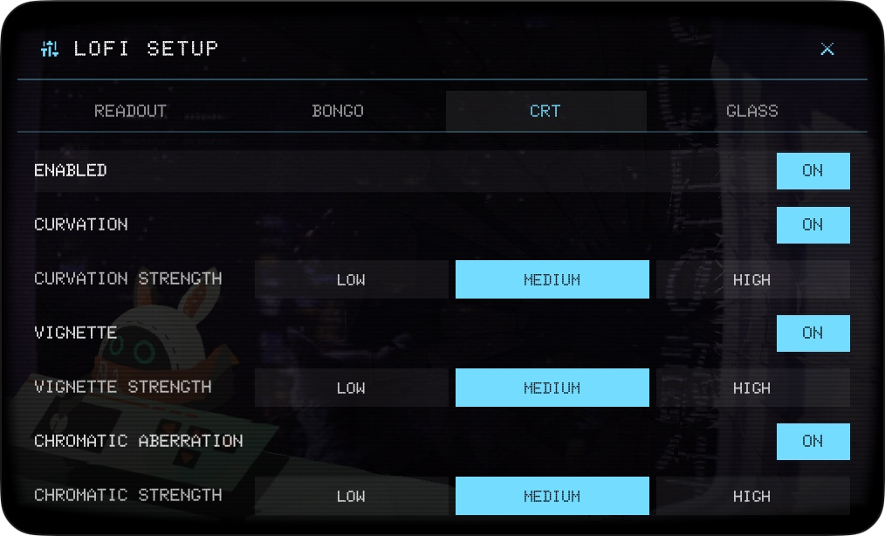

<div align="center">
  <br />
  
  <h1>Lofii</h1>
  <p><strong>Native macOS</strong> <strong>lofi radio</strong> plus <strong>moving desk scenery</strong>: stream stations, loop cinematic or GIF scenes, or hang out with <strong>Live2D BongoCat</strong> — a compact on-screen presence so <strong>sound and motion</strong> stay in view without turning into another full-size app.</p>
  <p>
    <a href="https://github.com/rhinoc/lofii/releases">Releases</a>
    &nbsp;·&nbsp;
    <a href="./LICENSE">License</a>
    &nbsp;·&nbsp;
    <a href="./CREDITS.md">Credits</a>
    &nbsp;·&nbsp;
    <a href="./CONTRIBUTING.md">Contributing</a>
  </p>
  <br />
</div>

## Screenshots

<table>
  <tr>
    <td align="center"></td>
    <td align="center"></td>
    <td align="center"></td>
  </tr>
</table>

## Features

- **Hand-picked stations** — Chillhop, SomaFM, Poolsuite; now-playing when the stream sends it.
- **Moving wallpaper** — cinematic loops or GIF scenes; rainy nights, neon city, moonlight—swap in a click.
- **Live2D BongoCat** — on your desk, reacting to keys and cursor.
- **Edge-of-screen player** — hover to drive it; pin on top when you want it always there.

## Requirements

- **macOS** 26.0 or newer.
- **Xcode** 26.4 or a compatible Swift 6.3 toolchain.
- **Live2D Cubism SDK for Native.** This repository does not commit Cubism Core; install it from the official SDK archive before building.
- **Network access** on first launch for remote scene, GIF, radio, and metadata requests.
- **Release builds with automatic updates:** Sparkle signing keys and, for public distribution, Apple code-signing/notarization credentials.

## Install

**Download** the latest zip from **[GitHub Releases](https://github.com/rhinoc/lofii/releases)**, unzip it, and open **`lofii.app`** (moving it to **Applications** first is fine).

Downloads from the browser are tagged with Gatekeeper **quarantine** (`com.apple.quarantine`). If the build is not **Developer ID**-signed and **notarized** (for example ad-hoc CI builds without an Apple Developer Program membership), macOS may block or warn on first launch.

After unzipping, you can remove quarantine from the app bundle:

```bash
xattr -dr com.apple.quarantine /path/to/lofii.app
```

Alternatively, move `lofii.app` to **Applications**, then **Control-click (or right-click) → Open** once and confirm in the dialog—this records an exception for that app.

## Usage

**First launch** downloads the selected scene or GIF into the local cache. Scene MP4s are roughly 1-4 MB each.

**Local cache:**

- Cinematic scenes: `~/Library/Caches/Lofii/scenes/`
- GIF assets: `~/Library/Caches/Lofii/gifs/`
- Imported BongoCat packs: `~/.lofii/bongo/<name>/`

Custom BongoCat model import and preparation tools are documented in **[Support/README.md](./Support/README.md)**.

**Keyboard shortcuts:**

- `Space`: play or pause
- `Left Arrow` / `Right Arrow`: switch scenes
- `Command-V`: cycle day, night, rain, and night-rain variants in Cinematic mode
- `Command-M`: switch Cinematic / GIF / BongoCat modes
- `G`: next GIF in GIF mode
- `Command-T`: toggle always-on-top

## Development

The repo is a **Swift Package**: `Package.swift` declares an **`executableTarget`** named `lofii` that compiles into the same kind of **`.app`** you download from Releases—SPM is just how the source is organized (`swift build`, `swift run lofii`, or open the package in Xcode), not a different product format for users.

**Stack:** SwiftUI / AppKit (shell), AVFoundation (audio), Metal (scenes / effects), Sparkle (updates), Live2D Cubism Native (BongoCat).

From the repository root, install **Live2D Cubism Core** (not committed here), then build, test, or run the app target:

```bash
scripts/install_cubism_core.sh
swift build
swift test
swift run lofii
```

You can also open `Package.swift` in Xcode and run the `lofii` executable target.

Create a local release zip:

```bash
scripts/build_release.sh
```

Release automation is documented in **[SPARKLE.md](./SPARKLE.md)**. The release workflow expects GitHub Actions secrets for Sparkle update signing and optional Apple code signing.

## Contributing

**Issues and pull requests** are welcome. Before opening a large change, open an issue to discuss the direction and licensing impact.

For local setup, coding conventions, tests, asset rules, and release boundaries, read **[CONTRIBUTING.md](./CONTRIBUTING.md)**.

## Third-Party Assets and Licenses

Original project source code is licensed under the **Mozilla Public License 2.0**. See **[LICENSE](./LICENSE)**.

That license does not override third-party terms. This repository includes or references assets, fonts, SDK components, and services with separate licenses or usage terms. See **[CREDITS.md](./CREDITS.md)** for attribution and current redistribution notes.

**Important boundaries:**

- Live2D Cubism Framework source is governed by the Live2D Open Software License.
- Live2D Cubism Core headers and runtime library are governed by the Live2D Proprietary Software License and are installed from the official SDK package, not committed to this repository.
- Bundled BongoCat-compatible model packs and lofi visual media require source-by-source redistribution verification before a public release.