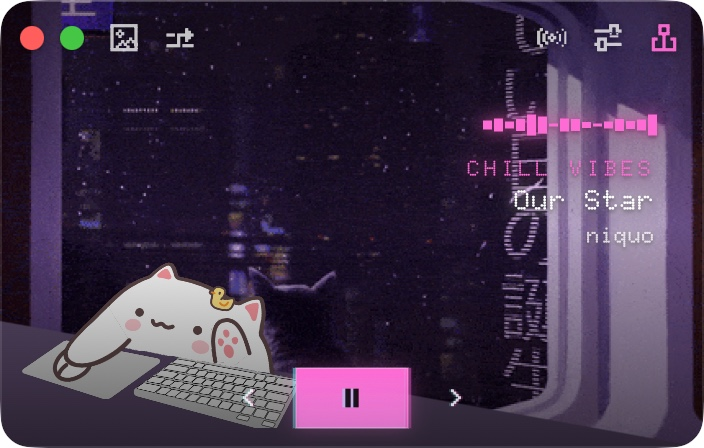
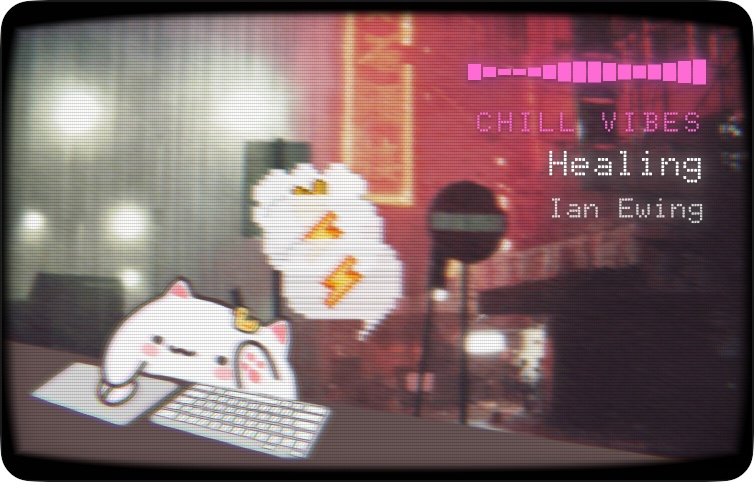
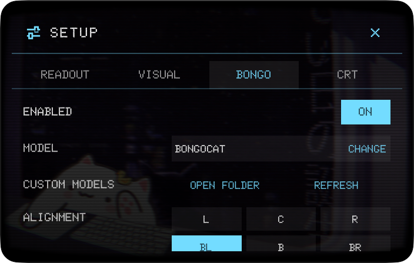
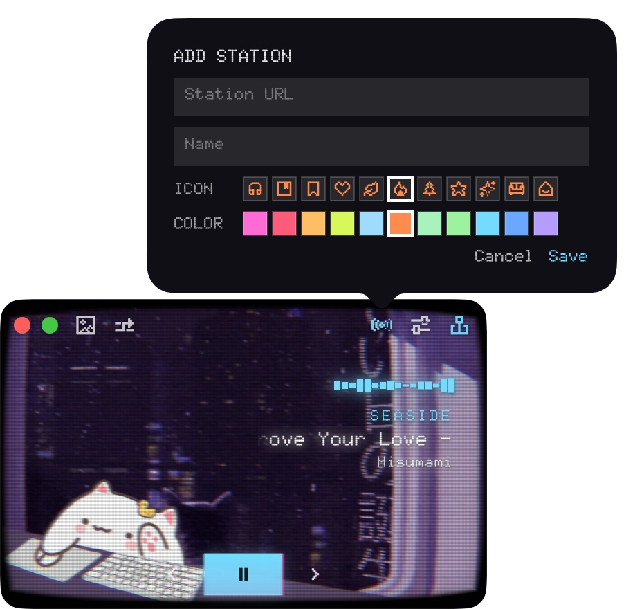
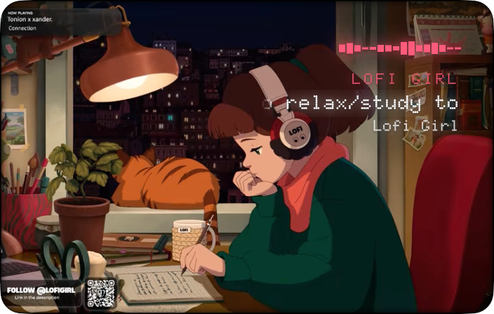

<div align="center">
  <br />
  
  <h1>Lofii</h1>
  <p>Your desk, but with a soundtrack.<br />
  Stream lofi stations, fill the screen with ambient scene loops, drop in your own media, or let local coding-agent activity show up as <strong>Agent Companion</strong> bubbles above a <strong>Live2D BongoCat</strong> — all in a compact native macOS window that stays out of the way and always within reach.</p>
  <p>
    <a href="https://github.com/rhinoc/lofii/releases">Releases</a>
    &nbsp;·&nbsp;
    <a href="./LICENSE">License</a>
    &nbsp;·&nbsp;
    <a href="./CREDITS.md">Credits</a>
    &nbsp;·&nbsp;
    <a href="./CONTRIBUTING.md">Contributing</a>
  </p>
  <br />
</div>

## Screenshots

<table>
  <tr>
    <td align="center">
      
      <br />
      <sub>Live2D BongoCat companion</sub>
    </td>
    <td align="center">
      
      <br />
      <sub>Agent Companion reactions</sub>
    </td>
    <td align="center">
      
      <br />
      <sub>Visual tuning controls</sub>
    </td>
  </tr>
</table>

<table>
  <tr>
    <td align="center">
      
      <br />
      <sub>Station picker</sub>
    </td>
    <td align="center">
      
      <br />
      <sub>YouTube visual mode</sub>
    </td>
  </tr>
</table>

## Features

- 🎧 **Radio that fits your flow** — Start with Chillhop, SomaFM, and Poolsuite, or add your own YouTube, Twitch, Bilibili Live, direct video, and audio stream stations.
- 🌃 **Ambient visuals in one click** — Switch between Live, Scene, and Media modes with rainy windows, neon city loops, imported files, or current track artwork.
- 📺 **A tunable retro screen** — Shape the vibe with CRT curvation, vignette, scanlines, motion blur, shattered glass, waveform, glow, and readout styling.
- 🤖 **Agent Companion reactions** — Turn local Codex activity into small status bubbles above BongoCat, grouped by agent session and rendered through the same CRT pass.
- 🐾 **Live2D BongoCat companion** — Keep a small desk friend on screen that reacts to keys and cursor, with importable model packs, placement, size, and input controls.
- 📌 **A player that stays out of the way** — Park it on the screen edge, reveal controls on hover, and pin it above other windows when you want it always visible.

## Requirements

- **macOS** 26.0 or newer.
- **Network access** on first launch for remote scenes, media, radio, and metadata requests.

## Install

Lofii ships as a macOS disk image. Download the latest **`lofii-<version>-macos.dmg`** from **[GitHub Releases](https://github.com/rhinoc/lofii/releases)**.

1. Open the DMG (double-click the download).
2. In the mounted window, drag **`lofii.app`** onto the **Applications** shortcut.
3. Eject the disk image, then launch **Lofii** from **Applications** or Spotlight.

The DMG contains `lofii.app` and an **Applications** shortcut only — there is no separate installer or package manager step.

### First launch and Gatekeeper

Browser downloads are tagged with Gatekeeper **quarantine** (`com.apple.quarantine`). If macOS warns that the app cannot be opened or is from an unidentified developer, use one of the options below after copying the app to **Applications**.

Remove quarantine from the installed app:

```bash
xattr -dr com.apple.quarantine /Applications/lofii.app
```

Or **Control-click (or right-click) → Open** on `lofii.app` once and confirm in the dialog. macOS records that exception for future launches.

In-app updates (Sparkle) use the same DMG format; after an update finishes, drag the new app to **Applications** the same way if macOS leaves the updated bundle outside `/Applications`.

## Usage

**First launch** downloads the selected scene or built-in media into the local cache. Scene MP4s are roughly 1–4 MB each.

### Custom BongoCat models

Lofii accepts the same Live2D model packs as **[ayangweb/BongoCat](https://github.com/ayangweb/BongoCat)**. Browse community packs in **[Awesome-BongoCat](https://github.com/ayangweb/Awesome-BongoCat)**, download one you like, then copy the unpacked folder into:

```text
~/.lofii/bongo/<pack-name>/
```

Each subfolder is one entry in the in-app model picker (**Settings → Bongo → Model**, or the right-click menu). After adding or replacing files, choose **Reload Models** so Lofii rescans the directory.

For optional key maps, desktop mask layout, and maintainer prep tools, see **[Support/README.md](./Support/README.md)**.

### Agent Companion

Agent Companion turns local coding-agent activity into lightweight status bubbles above BongoCat. Use **Settings → Bongo → Agent Companion** or the right-click **Bongo Cat → Agent Companion** menu to enable it, choose the bubble position, flip bubble tails, and install or remove Codex hooks.

The hook bridge is local and short-lived: agent hooks send normalized events to the Lofii app over a Unix socket, and the app groups activity by source and session. Hook events can be toggled individually; changing a hook toggle reinstalls the managed hook entries.

### Custom media

Drop your own visuals into:

```text
~/.lofii/media/
```

Supported formats: **`.gif`**, **`.png`**, **`.jpg`**, **`.jpeg`**, **`.mp4`**, **`.m4v`**, and **`.mov`**. Switch to **Media** mode (right-click menu or settings), then choose **Reload Custom Media** so new files appear in the rotation. Press **`G`** to skip to the next item while in Media mode.

### Custom stations

Open the station picker, click **`+`**, and paste a YouTube, Twitch, Bilibili Live, direct video, or direct audio stream URL. Built-in stations can also be edited and reset from the same picker.

### Visual tuning

Use **Settings** or the right-click menu to adjust CRT effects, shattered glass, and readout style.

### Keyboard shortcuts

- `Space`: play or pause
- `Command-Left Arrow` / `Command-Right Arrow`: switch stations
- `G`: next item in Media mode

### Local data locations

| Location | What it stores | Notes |
| --- | --- | --- |
| `~/Library/Application Support/Lofii/` | App-managed settings and station data | Custom stations are saved in `custom-stations.json`. |
| `~/Library/Caches/Lofii/` | Downloaded scenes, built-in media, and track artwork | Includes `scenes/`, `gifs/`, and `track-artwork/`. Safe to rebuild from remote sources. |
| `~/.lofii/media/` | User-imported visual media | See **Custom media** above. |
| `~/.lofii/bongo/<name>/` | User-imported BongoCat model packs | See **Custom BongoCat models** above. |

## Contributing

For development setup, coding conventions, tests, asset rules, and release boundaries, read **[CONTRIBUTING.md](./CONTRIBUTING.md)**.

## Third-Party Assets and Licenses

Original project source code is licensed under the **Mozilla Public License 2.0**. See **[LICENSE](./LICENSE)**.

That license does not override third-party terms. This repository includes or references assets, fonts, SDK components, and services with separate licenses or usage terms. See **[CREDITS.md](./CREDITS.md)** for attribution and current redistribution notes.

**Important boundaries:**

- Live2D Cubism Framework source is governed by the Live2D Open Software License.
- Live2D Cubism Core headers and runtime library are governed by the Live2D Proprietary Software License and are installed from the official SDK package, not committed to this repository.
- Bundled BongoCat-compatible model packs and lofi visual media require source-by-source redistribution verification before a public release.
